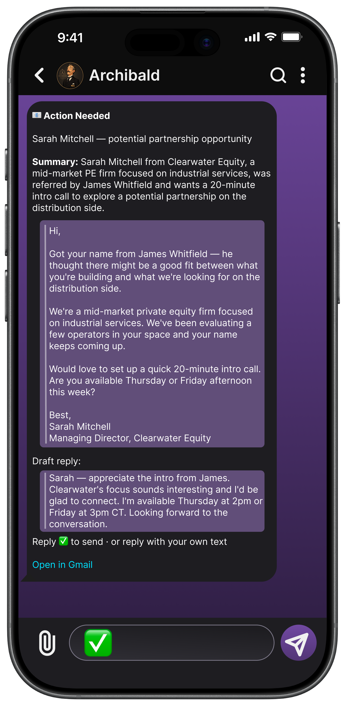

<div align="center">


# Otian AI

**Secure AI agents, your way.**<br>
Easy plug-and-play, fully in your control.

[](https://otianai.com)
[](https://github.com/JettNguyen/Otian-AI/actions/workflows/deploy.yml)
[](#running-the-site-locally)
[](https://otianai.com/archie/#status)

[**otianai.com**](https://otianai.com) · [What Is Archie?](https://otianai.com/archie/) · [Add-ons](https://otianai.com/skills-marketplace/browse/) · [Pricing](https://otianai.com/archie/pricing/) · [Trust](https://otianai.com/trust/)

</div>

---

## An AI agent that's actually yours

**Archie** is a desktop app that gives you your own AI agent. It handles the busywork in your
inbox and calendar, keeps track of the bills, the refills and the birthdays, and works from the
chat apps you already use.

No terminal. No code. No middleman. No ceiling.

> [!NOTE]
> **Archie is in testing.** Nothing on the site is for sale yet, and the marketplace opens with
> Archie's launch. The prices below are the ones it will launch with, told now so there are no
> surprises later. [See where it stands](https://otianai.com/archie/#status).

### A chatbot answers. An agent works.

|  | What you get |
|---|---|
| **A chatbot** | Answers when you sit down to ask. When you close the tab, the work is still yours to do. |
| **Your agent** | Runs on a schedule, remembers what you tell it, and messages you first when it finishes something. |

Most people don't go looking for an AI agent. They just have a week that looks like this:

| The moment | What your agent does |
|---|---|
| **Monday, 9 a.m.** | Reads back last week's meeting transcripts while you pour your coffee. |
| **The reply you keep meaning to send** | Writes the draft and drops it in your chat with a Send button. |
| **The 3 o'clock that has to move** | Proposes the exact calendar change and makes it after you approve. |
| **The thing you swore you'd remember** | Holds onto it, then messages you first when the time comes. |

None of it is an emergency. That's the point: it's the small, steady tax on your attention, and
an agent is what quietly pays it down.

<div align="center">

</div>

---

## Yours in ways most AI isn't

Most AI assistants live on someone else's servers, on a monthly bill. Archie is built the other
way around.

**Your work stays yours.** Your conversations and files live on your own computer and go straight
to your AI provider (the AI company, like Anthropic or OpenAI) on your own account, with your own
key. They never pass through an Otian server, so there is nothing on our side to leak or lose.

**Our servers know three things about you:** your email address, whether you have a current plan, and
which paid add-ons you've bought. Not your prompts, not your files, not your calendar, not a
single conversation. We keep no per-person record of the free add-ons you install.

**You hold the switches on the parts that matter.** Archie can draft an email reply, but it
cannot send one on its own: the draft comes to your chat with Send, Edit and Dismiss buttons, and
nothing reaches Gmail until you tap Send. It asks before it changes anything in your calendar.
And it cannot spend your money, because no purchase path exists in the app at all.

**It works while you sleep.** Routines run on a schedule, unattended, and report back to your
chat when they're done.

**One more thing you didn't ask.** If your agent searches the web, that search runs on the AI
provider's infrastructure and is billed to your key, so the query reaches their search backend,
not just their model. Still not us.

> The whole list, including the parts that don't flatter us, is on the
> [Trust page](https://otianai.com/trust/): every outbound connection Archie makes, what is in
> it, and who receives it.

---

## Agents, shaped by Add-ons

Add-ons are ready-made upgrades from the built-in marketplace, installed in a click. More than
eighty are built and waiting for launch, in four kinds.

| Kind | What it is |
|---|---|
| **Skills** | The things your agent can do. Inbox triage, calendar management, meeting notes. |
| **Specialists** | Specialists your agent hands work to (a researcher, a writer), each focused on one thing. |
| **Routines** | Things it does on its own, on a schedule. A briefing every morning, a report every Friday. |
| **Personalities** | How your agent talks to you. Warm and chatty, or brief and to the point. |

An add-on is a text file, not a program. A Skill is markdown plus settings. It cannot run code on
your computer, because Archie has nowhere to run it.

If Archie can't do something you need, [we'll build the add-on](https://otianai.com/skills-marketplace/commission/),
and it joins the marketplace for everyone.

---

## What it will cost

Three costs. One of them is ours. The other two are yours, paid straight to the people providing
them, and we never take a cut of either.

| | Price | |
|---|---|---|
| **The app** | **$30** a month, or **$299** a year | A year is $61 less than twelve months bought one at a time. Change or stop it any time. |
| **Add-ons** | **Free** | Every add-on in the catalog is `price_cents: 0`. The paid path exists (`require_owned_if_paid`) and a purchase would be permanent, but nothing uses it today. |
| **The AI itself** | **Pay as you go** | Your own account with Anthropic, OpenAI, Google, Groq or xAI. It bills you directly. |

The third cost is the one that varies, so the [pricing page](https://otianai.com/archie/pricing/)
works it out for three levels of use, with the modelling shown.

**Guided setup** is there if you would rather not do it alone: $250 a session, one hour each,
starting with a free 30-minute call.

---

## The site, page by page

| Section | Pages |
|---|---|
| **Archie** | [What Is Archie?](https://otianai.com/archie/) · [See It Work](https://otianai.com/archie/see-it-work/) · [Pricing](https://otianai.com/archie/pricing/) · [Guided Setup](https://otianai.com/individuals/) |
| **Add-ons** | [What's an Add-on?](https://otianai.com/skills-marketplace/what-is-an-add-on/) · [Browse](https://otianai.com/skills-marketplace/browse/) · [Commission One](https://otianai.com/skills-marketplace/commission/) · [For Developers](https://otianai.com/skills-marketplace/for-developers/) |
| **Learn** | [How It Works](https://otianai.com/how-it-works/) · [AI Explained](https://otianai.com/ai-explained/) · [Blog](https://otianai.com/blog/) · [FAQ](https://otianai.com/faq/) · [What You Need](https://otianai.com/what-you-need/) |
| **Company** | [Our Story](https://otianai.com/our-story/) · [Reviews](https://otianai.com/testimonials/) · [Contact](https://otianai.com/contact/) · [Trust](https://otianai.com/trust/) |

`business/` is written but not published: it is held back until the Archie business edition is
close to ready, so <https://otianai.com/business/> returns the 404 page. The directory stays in
the repo and is deleted in the "Withhold unpublished pages" step of
[`deploy.yml`](.github/workflows/deploy.yml) before the upload, and `firebase.json` ignores it so
local serving matches. Publishing it means dropping that `rm`, dropping the `firebase.json`
ignore, dropping the `robots` meta in the page, and putting the "For Business" link back in three
places per page (nav menu, mobile drawer, footer).

---

## About this repository

This is the source of **otianai.com**: the marketing site, and only the marketing site. The Archie
desktop app is a separate codebase, and nothing in here runs an agent.

It is hand-written static HTML. No framework, no bundler, no build step. Every push to `main`
deploys to GitHub Pages through [`.github/workflows/deploy.yml`](.github/workflows/deploy.yml).

### Running the site locally

```bash
git clone https://github.com/JettNguyen/Otian-AI.git
cd Otian-AI
python3 scripts/dev-server.py
```

Then open <http://localhost:5501>. Pages reload themselves when you save. Use a local server
rather than opening the files from disk: every page lives in its own directory as an
`index.html`, so the links only resolve when something is serving directory indexes.

Any static server will do (`python3 -m http.server 8000` works), but reload-on-save will not.
That includes VS Code's Live Server, which does its reloading by appending an inline `<script>`
to the HTML: the Content-Security-Policy in every page lists a sha256 for each inline script and
does not allow `'unsafe-inline'`, so the browser blocks that one and saving a file appears to do
nothing at all. `scripts/dev-server.py` injects the same kind of script and adds its hash to the
policy on the way out, leaving the rest of the policy exactly as it ships, so a real CSP mistake
still breaks locally the way it would in production. Pass `--no-reload` when pointing headless
Chrome at it, or the open event stream keeps the page from ever going idle.

### Layout

```
index.html              the homepage
404.html                served by Pages on a bad URL
<page>/index.html       one directory per page (archie/, trust/, faq/, blog/...)
css/styles.css          the single stylesheet for the whole site
js/                     one small module per page that needs one
  nav.js                shared: theme, nav, drawer, loaded everywhere
  catalog.js            reads the live add-on catalog from Firestore
assets/                 logos, screenshots, demo video, diagrams
data/marketplace/       local copies of catalog shapes (the live catalog is Firestore,
                        seeded from the Archie repo)
TRUST.md                every privacy claim we are allowed to make, with code pointers
CLAUDE.md               the house rules below, in full
```

There is no templating, so the nav is duplicated in every page (twice per page: desktop nav and
mobile drawer). Nav changes have to be scripted across all pages rather than edited by hand.

### If you edit copy

Four rules carry most of the weight. [CLAUDE.md](CLAUDE.md) has the rest.

1. **Read [TRUST.md](TRUST.md) before writing any sentence about privacy, security, data handling,
   or what the agent will and won't do without asking.** It lists every claim we are allowed to
   make, in approved wording, each pointing at the code that makes it true. If a claim is not in
   there, it does not ship until it is verified and added. The test: could you defend this exact
   sentence to a hostile engineer with a packet sniffer, using only what ships today?
2. **No em dashes.** Not the character, not the entity, not anywhere in a served file. Restructure
   with a colon, comma, semicolon, period or parentheses. Check with
   `git grep -P '\x{2014}|mdash'` before committing (the escape keeps the check itself clean).
3. **"Add-on" is the umbrella noun**; Skills, Specialists, Routines and Personalities are its
   kinds. Never "add an add-on".
4. **Plain words, and never talk down.** Write so a first-time, non-technical reader understands
   without feeling stupid. Define a term the first time it appears, keep one name per concept
   across the whole site, and never state a problem without the next step. Show ease by being
   clear; don't assert it.

Never describe an unshipped feature in the present tense. Roadmap items are labelled as roadmap,
with a date, or they are absent.

---

## Who we are

A two-person team. We set up agents by hand, one person at a time, until we knew where every ounce
of friction lived. Archie is what we learned, compiled.

**Jett Nguyen**, Engineering & Implementation · **Jack Raney**, Discovery & Client Strategy

Our mission: to give ordinary people an AI agent they actually own, one that removes the friction
from daily life and puts real leverage back in their hands.
[Read our story](https://otianai.com/our-story/).

---

<div align="center">

**Ready to get your time back?** Your first discovery call is free.

[**Get started**](https://otianai.com/questionnaire/) · [Contact us](https://otianai.com/contact/)

<sub>Site copy, brand marks and product screenshots © Otian AI. No open-source license is granted.</sub>

</div>
