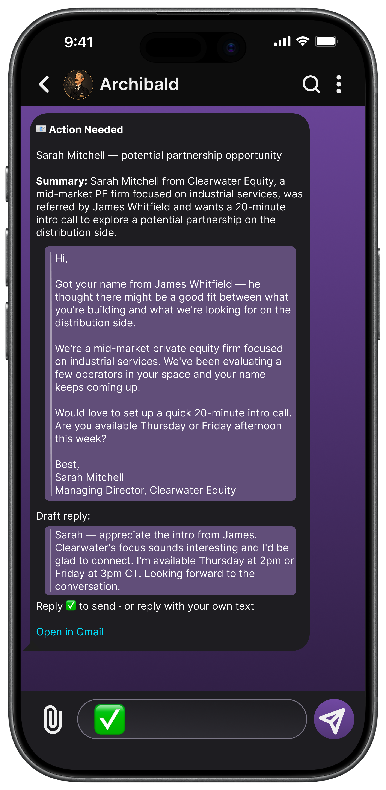

<div align="center">


# Otian AI

**Don't rent your agent. Own it.**™<br>
Yours to shape & yours to keep. Never ours.

[](https://otianai.com)
[](https://github.com/JettNguyen/Otian-AI/actions/workflows/deploy.yml)
[](#running-the-site-locally)
[](https://otianai.com/archie/personal/#status)

[**otianai.com**](https://otianai.com) · [What Is Archie?](https://otianai.com/archie/personal/) · [Add-ons](https://otianai.com/skills-marketplace/browse/) · [Pricing](https://otianai.com/archie/pricing/) · [Trust](https://otianai.com/trust/)

</div>

---

## Archie runs an AI agent on your own computer for your email, calendar and bills

**Archie**, by Otian AI, is a desktop app for Mac and Windows. The agent it runs drafts your
email replies, keeps track of the bills, the refills and the birthdays, and answers you from your
phone or the chat app you already use.

> [!NOTE]
> **Archie is in beta on Mac and Windows.** It is free on an AI account of your own at 20 jobs a
> day, and plans are on sale. [Download Archie](https://otianai.com/archie/install/).

### A week of small jobs, handed off

| The moment | What your agent does |
|---|---|
| **The reply you keep meaning to send** | Writes the draft and drops it in your chat with a Send button. |
| **The bill due on the 15th** | Keeps track of it and reminds you before it is due. |
| **The 3 o'clock that has to move** | Proposes the exact calendar change and makes it after you approve. |
| **The thing you swore you'd remember** | Holds onto it, then messages you first when the time comes. |

<div align="center">

</div>

---

## Your agent lives on your computer, and you hold the switches

**Your agent's files and chat history live on your computer.** On an AI account of your own, its
thinking goes straight from your computer to that AI company (Anthropic or OpenAI, for example),
and we keep no copy we can read. The free starter credits, and the plan with the AI included, run
through a server of ours, which measures spend without recording what was said.

**What we hold** is your email address, your plan, a handful of operational records, and, if phone
access is on, sealed messages we cannot read. We keep no per-person record of the add-ons you
install.

**Email waits for you.** Your agent drafts a reply and brings it to your chat with Send, Edit and
Dismiss buttons, and no email goes out until you send it or set a time. A calendar change applies
only after you approve it. Buying is off until you switch it on, and then it works only at shops
you pick, up to limits you set.

**Routines run on the schedule you set,** overnight included, and report back to your chat. Your
computer needs to be on and Archie open.

**Web searches go to your AI company too.** When your agent searches the web, the search runs at
the AI company, so the words of the search reach their search service as well as their AI.

> The whole list, including what we have not solved, is on the
> [Trust page](https://otianai.com/trust/): every outbound connection Archie makes, what is in
> it, and who receives it.

---

## 170 add-ons give your agent its jobs

Add-ons are ready-made jobs from the marketplace inside Archie, installed in a click, in three
kinds.

| Kind | What it is |
|---|---|
| **Skills** | The things your agent can do. Inbox triage, bills and subscriptions, meeting notes. |
| **Routines** | Things it does on a schedule. A briefing every morning, a bill reminder before the due date. |
| **Personalities** | How your agent talks to you. Warm and chatty, or brief and to the point. |

An add-on is a text file your agent reads. A Skill is written instructions plus settings. It
cannot run code or a command on your computer, because Archie has nowhere to run one.

If the job you need is missing, [we can build the add-on for you](https://otianai.com/services/#commission),
on a quote per add-on.

---

## What Archie costs

| | Price |
|---|---|
| **Free** | On an AI account of your own, at 20 jobs a day. The count starts again at midnight. |
| **A plan** | **$30** a month, or **$299** a year. Takes the limit off, up to 10 agents, with every add-on. |
| **The AI itself** | Billed to you by the AI company you pick, at their price. We add nothing to it. |
| **The AI included** | **$59** a month, or **$599** a year, with $25 of AI use a month. Email and text reading need your own AI account. |
| **Archie for Business** | **$99** a month, or **$999** a year. |

The AI bill runs from $1 to $5 a month for a light agent, up to $139 for a heavy one. The
[pricing page](https://otianai.com/archie/pricing/) shows the working. Plans can be refunded within
14 days of first starting one.

**Guided setup** is $250 for an hour, with us, over Zoom. It starts with a free call.

---

## The site's main pages

| | Pages |
|---|---|
| **Archie** | [For Personal](https://otianai.com/archie/personal/) · [For Business](https://otianai.com/archie/business/) · [How It Works](https://otianai.com/how-it-works/) · [Archie Mobile](https://otianai.com/archie/mobile/) · [Pricing](https://otianai.com/archie/pricing/) |
| **Add-ons** | [What's an Add-on?](https://otianai.com/skills-marketplace/what-is-an-add-on/) · [Browse](https://otianai.com/skills-marketplace/browse/) · [For Developers](https://otianai.com/skills-marketplace/for-developers/) |
| **Services** | [Work With Us](https://otianai.com/services/) · [Commission an Add-on](https://otianai.com/services/#commission) |
| **Learn** | [Learning Library](https://otianai.com/learn/ai-basics/) · [Compare](https://otianai.com/compare/) · [AI Explained](https://otianai.com/ai-explained/) · [Blog](https://otianai.com/blog/) · [FAQ](https://otianai.com/faq/) · [Troubleshooting](https://otianai.com/help/) |
| **Company** | [Our Story](https://otianai.com/our-story/) · [Reviews](https://otianai.com/testimonials/) · [Contact](https://otianai.com/contact/) · [Trust](https://otianai.com/trust/) |

---

## About this repository

This is the source of **otianai.com**: the marketing site, and only the marketing site. The Archie
desktop app is a separate codebase, and nothing in here runs an agent.

It is hand-written static HTML with no framework or bundler. Every push to `main` runs the checks,
builds an allowlisted public artifact, and deploys that artifact to GitHub Pages through
[`.github/workflows/deploy.yml`](.github/workflows/deploy.yml). Repository documents and tools are
excluded by default.

### Running the site locally

```bash
git clone https://github.com/JettNguyen/Otian-AI.git
cd Otian-AI
python3 scripts/dev-server.py
```

Then open <http://localhost:5501>. Pages reload themselves when you save. Use a local server
rather than opening the files from disk: every page lives in its own directory as an
`index.html`, so the links only resolve when something is serving directory indexes.

Any static server will do (`python3 -m http.server 8000` works), but reload-on-save will not.
That includes VS Code's Live Server, which does its reloading by appending an inline `<script>`
to the HTML: the Content-Security-Policy in every page lists a sha256 for each inline script and
does not allow `'unsafe-inline'`, so the browser blocks that one and saving a file appears to do
nothing at all. `scripts/dev-server.py` injects the same kind of script and adds its hash to the
policy on the way out, leaving the rest of the policy exactly as it ships, so a real CSP mistake
still breaks locally the way it would in production. Pass `--no-reload` when pointing headless
Chrome at it, or the open event stream keeps the page from ever going idle.

### Layout

```
index.html              the homepage
404.html                served by Pages on a bad URL
<page>/index.html       one directory per page (archie/, trust/, faq/, blog/...)
css/styles.css          the single stylesheet for the whole site
js/                     one small module per page that needs one
  nav.js                shared: theme, nav, drawer, loaded everywhere
  catalog.js            reads the live add-on catalog from Firestore
assets/                 logos, screenshots, demo video, diagrams
data/public-catalog.json a snapshot of the public Firestore add-ons used by CI and static HTML
TRUST.md                every privacy claim we are allowed to make, with code pointers
CLAUDE.md               the house rules below, in full
```

There is no templating, so the nav is written out three times in every page (the desktop
dropdown, the mobile drawer and the footer column). Nav changes have to be scripted across all
pages and checked with `python3 scripts/check-nav.py`.

### If you edit copy

Four rules carry most of the weight. [CLAUDE.md](CLAUDE.md) has the rest.

1. **Read [TRUST.md](TRUST.md) before writing any sentence about privacy, security, data handling,
   or what the agent will and won't do without asking.** It lists every claim we are allowed to
   make, in approved wording, each pointing at the code that makes it true. If a claim is not in
   there, it does not ship until it is verified and added. The test: could you defend this exact
   sentence to a hostile engineer with a packet sniffer, using only what ships today?
2. **No em dashes.** Not the character, not the entity, not anywhere in a served file. Restructure
   with a colon, comma, semicolon, period or parentheses. Check with
   `git grep -P '\x{2014}|mdash'` before committing (the escape keeps the check itself clean).
3. **"Add-on" is the umbrella noun**; Skills, Routines and Personalities are the kinds a reader
   sees. Never "add an add-on".
4. **Plain words, and never talk down.** Write so a first-time, non-technical reader understands
   without feeling stupid. Define a term the first time it appears, keep one name per concept
   across the whole site, and never state a problem without the next step. Show ease by being
   clear; don't assert it.

Never describe an unshipped feature in the present tense. Roadmap items are labelled as roadmap,
with a date, or they are absent.

---

## Who makes Archie

Otian AI is two people, **Jack Raney** (Co-Founder and Chief Executive Officer) and **Jett Nguyen**
(Co-Founder and Chief Technology Officer). We set up AI agents by hand, one person at a time, and
built Archie from what that taught us. [Read our story](https://otianai.com/our-story/).

---

<div align="center">

**Try Archie free on an AI account of your own, or talk it through with us first.**

[**Download Archie**](https://otianai.com/archie/install/) · [Book a free call](https://otianai.com/services/)

<sub>Site copy, brand marks and product screenshots © Otian AI. No open-source license is granted.</sub>

</div>
